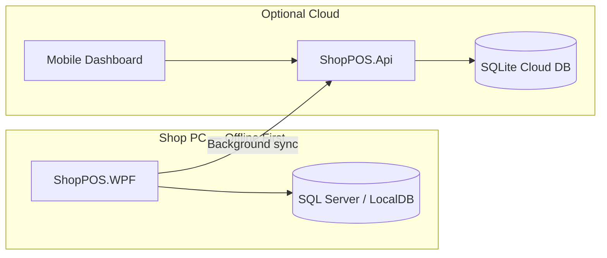

# ShopPOS — Enterprise Retail Point of Sale

[](https://github.com/rashidaslam8500/ShopPOS/actions/workflows/build.yml)


**Production-grade desktop POS** built for crockery & retail shops — fast billing, inventory, returns, staff finance, vendor khata, cloud dashboard, and customer notifications.

> **Live deployment:** KitchenMart.pk / Bhai Gee Crockery Store — Sargodha, Pakistan

---

## Why ShopPOS?

| Challenge | ShopPOS solution |
|-----------|------------------|
| Slow checkout at busy counters | Real-time search, barcode scan, one-click billing |
| Returns at wrong price | Original invoice rate preserved automatically |
| Stock mistakes | Transaction-safe sales + live inventory |
| Owner needs control | Role-based access, audit logs, trash with owner PIN |
| Shop + cloud visibility | Optional hybrid sync + mobile-friendly dashboard |
| Customer follow-up | SMS, WhatsApp, and email thank-you after sale |

---

## Feature highlights

### Billing & checkout
- Smart product search with live suggestions (name, SKU, barcode)
- Cash, card, and mobile wallet payments
- Discount (amount), tax, change calculation
- Thermal receipt with logo, barcode/QR, amendment history
- Customer phone & email capture at checkout

### Inventory & products
- Categories, stock levels, internal barcode generation
- Low-stock awareness on dashboard
- Full CRUD with audit trail

### Returns & amendments
- Load invoice by receipt number or scan
- Partial returns at **original sale price**
- Add items to existing invoice without overwriting history
- Printable two-section receipt (original + amendments)

### Owner & staff
- **Owner** — full access: settings, audit, trash, vendor khata, staff expenses
- **Sales** — billing and returns only
- Fingerprint attendance (USB scanner or simulation mode)
- Worker profiles, advances, salary reports (PDF)

### Vendor khata (ledger)
- Purchase entries, payment modes, bill attachments
- PDF ledger reports, soft-delete trash with restore

### Integrations
- **Cloud sync** — REST API + background worker
- **Cloud API** — ASP.NET Core dashboard at `/` (mobile-friendly)
- **SMS / WhatsApp / Email** — post-sale thank-you messages
- **Hardware** — thermal printer, cash drawer kick, barcode scanner

### Security
- BCrypt passwords, security questions, encrypted settings secrets
- Immutable audit log
- Invoice trash (soft delete) + permanent purge (owner password)

---

## Architecture

```
ShopPOS.WPF          →  Desktop UI (WPF + MVVM)
ShopPOS.Api          →  Cloud sync API + web dashboard
ShopPOS.Business     →  Services, validation, transactions
ShopPOS.Data         →  EF Core + SQL Server repositories
ShopPOS.Domain       →  Entities, interfaces, models
```



See [docs/ARCHITECTURE.md](docs/ARCHITECTURE.md) for full design notes.

---

## Tech stack

| Layer | Technology |
|-------|------------|
| Desktop UI | WPF, .NET 10, MVVM (CommunityToolkit) |
| Cloud API | ASP.NET Core 10, SQLite |
| Database | Microsoft SQL Server / LocalDB |
| ORM | Entity Framework Core 10 |
| Reports | QuestPDF |
| Barcodes | ZXing.Net |
| DI / hosting | Microsoft.Extensions.Hosting |

---

## Quick start (developers)

### Prerequisites
- Windows 10/11
- [.NET 10 SDK](https://dotnet.microsoft.com/download/dotnet/10.0)
- SQL Server Express or LocalDB

### 1. Clone & configure

```powershell
git clone https://github.com/rashidaslam8500/ShopPOS.git
cd ShopPOS
copy src\ShopPOS.WPF\appsettings.example.json src\ShopPOS.WPF\appsettings.json
```

Edit `appsettings.json` — set connection string, shop logo path (`Assets\shop-logo.png`), and optional cloud/SMS keys.

### 2. Run desktop POS

```powershell
dotnet run --project src\ShopPOS.WPF
```

### 3. Run cloud API (optional)

```powershell
dotnet run --project src\ShopPOS.Api
```

Open **http://localhost:5050** for the dashboard.

### 4. First login

Default seeded accounts (change immediately in Settings):

| Role | Username |
|------|----------|
| Owner | `owner` |
| Sales | `sales` |

> Passwords are set on first database seed — use Settings → Change Password after login.

---

## Client deployment (no source code)

End clients receive a **compiled install package only**, not this repository.

```powershell
powershell -ExecutionPolicy Bypass -File scripts\build-client-install-package.ps1
```

Output: `release\KitchenMart-POS-CLIENT-INSTALL.zip` — POS exe, optional cloud API, Urdu install guide.

Developer source backup:

```powershell
powershell -ExecutionPolicy Bypass -File scripts\backup-developer-source.ps1
```

---

## Project structure

```
ShopPOS/
├── src/
│   ├── ShopPOS.WPF/       Desktop application
│   ├── ShopPOS.Api/       Cloud sync + dashboard
│   ├── ShopPOS.Business/  Business logic
│   ├── ShopPOS.Data/      EF Core + repositories
│   └── ShopPOS.Domain/    Core models
├── database/              SQL schema reference
├── docs/                  Architecture, guides
├── scripts/               Build & backup automation
└── release/               Client install templates
```

---

## Legacy prototype

The original Python desktop prototype is preserved on branch [`legacy/python`](https://github.com/rashidaslam8500/ShopPOS/tree/legacy/python) for reference.

---

## Documentation

| Document | Description |
|----------|-------------|
| [ARCHITECTURE.md](docs/ARCHITECTURE.md) | System design |
| [CLIENT-INSTALL-GUIDE-URDU.pdf](docs/CLIENT-INSTALL-GUIDE-URDU.pdf) | Urdu client install guide |
| [database/schema.sql](database/schema.sql) | Manual DB setup |

---

## License

MIT — see [LICENSE](LICENSE).

---

## Author

**Rashid Aslam** — [github.com/rashidaslam8500](https://github.com/rashidaslam8500)

Built for real retail operations. Designed for speed, accuracy, and owner peace of mind.
